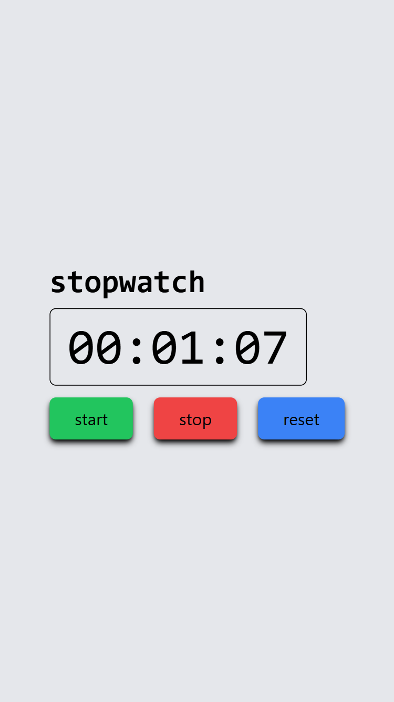

# JavaScript Dom

### 📝 **Stopwatch Project Description**

This is a basic **stopwatch web app** built using HTML, CSS, and JavaScript. It allows users to start, stop, and reset a timer. The time is displayed in a `HH:MM:SS` format and updates every second using JavaScript's `setInterval()` function. The project demonstrates **DOM manipulation**, **event handling**, and **time logic** in JavaScript, making it a great mini-project for beginners in web development.

---

### Screenshots

- 

---

### Demo Link

- [Live Demo](https://stop-watch-timer-dom.netlify.app/)

